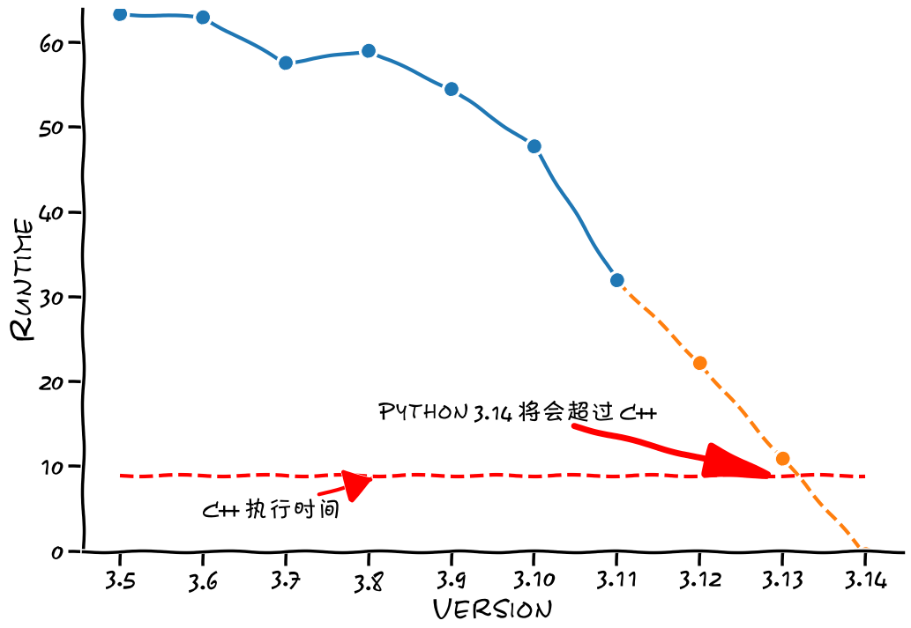

# Python 性能测试

[English](./README.md)

- [Python 性能测试](#python-性能测试)
  - [测试任务（K-mers） 基因组组装算法 DNA K-mers](#测试任务k-mers-基因组组装算法-dna-k-mers)
  - [依赖](#依赖)
  - [快速使用](#快速使用)
  - [运行 C++ 版本的任务](#运行-c-版本的任务)
  - [画图](#画图)
  - [作者](#作者)


使用 Docker 测试 Python 不同版本的性能，并且在相同任务上，与 C++ 进行对比。

> 注意:
> 优化后的 C++ 版本 (-O3) 的性能是 Python 3.11 版本的 110 倍, 它只需要 0.336514 秒, 而不是图片所显示的 11.1504 秒。 下图用来比较的是没有优化的 C++ 版本 (-O1)。

<p align="center"> 

</p> 


## 测试任务（K-mers） 基因组组装算法 DNA K-mers

DNA 是一个长串序列，称为核苷酸。在 DNA 中，有 4 种核苷酸以字母 A、C、G 和 T 表示。人类（或者更准确地说是智人）有 30 亿个核苷酸对。例如，人类 DNA 的一小部分可能是：

```
ACTAGGGATCATGAAGATAATGTTGGTGTTTGTATGGTTTTCAGACAATT
```

在这个例子中，如果想从这个字符串中选择任何 4 个连续的核苷酸（即字母），它将是一个长度为 4 的k-mer（我们称之为4-mer）。

以下是从示例中导出的一些 4-mers 示例。
```
ACTA, CTAG, TAGG, AGGG, GGGA, etc.
```

对于本文，让我们生成所有可能的 `13-mers`。

从数学上讲，这是一个置换问题。因此，我们有 $4^{13}（=67108864)$ 可能的 13-mers。

我用一个简单的算法在 C++ 和 Python 中生成结果。让我们看看不同 Python 版本和 C++ 的比较结果。

## 依赖
- Python 环境
- Docker

## 快速使用
```bash
python run_main_test.py
```

##  运行 C++ 版本的任务
[C++ 测试使用方法](k_mer_in_C/README.md)


## 画图
[XKCD 画图](notebookds/plotting_results.ipynb)

## 作者
- 作者：春阳CYang
- 链接：https://www.zhihu.com/question/538399507/answer/2700334978
- 来源：知乎
- 著作权归作者所有。商业转载请联系作者获得授权，非商业转载请注明出处。