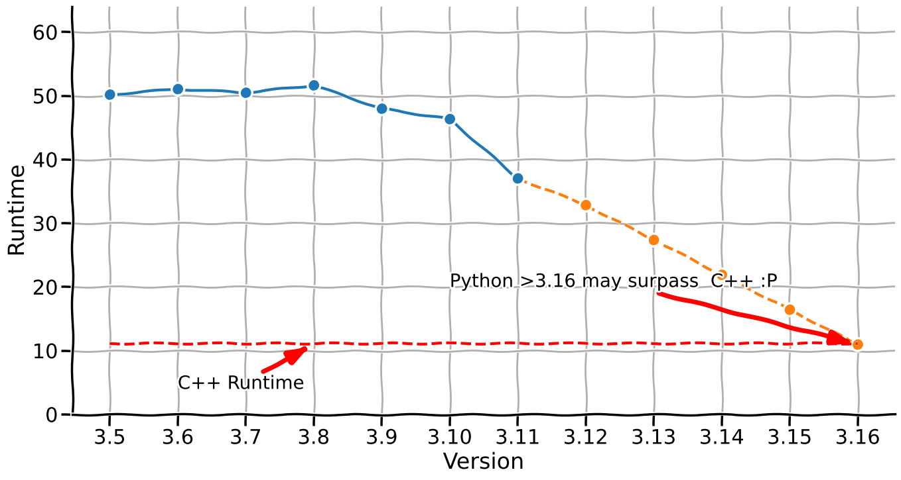

# Python 性能测试
使用 Docker 测试 Python 不同版本的性能，并且在相同任务上，与 C++ 进行对比。



## 博客
This is the code which belongs to a blog post you can find here.

## 依赖
- Python 环境
- Docker

## 快速使用
```bash
python run_main_test.py
```

[C++ 测试使用方法](https://github.com/CYang828/python-speedy/tree/master/k_mer_in_C)


## 画图
[XKCD 画图](https://github.com/CYang828/python-speedy/blob/master/notebookds/plotting_results.ipynb)